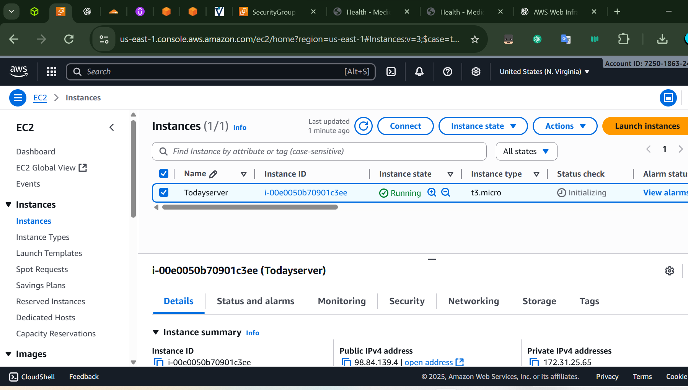
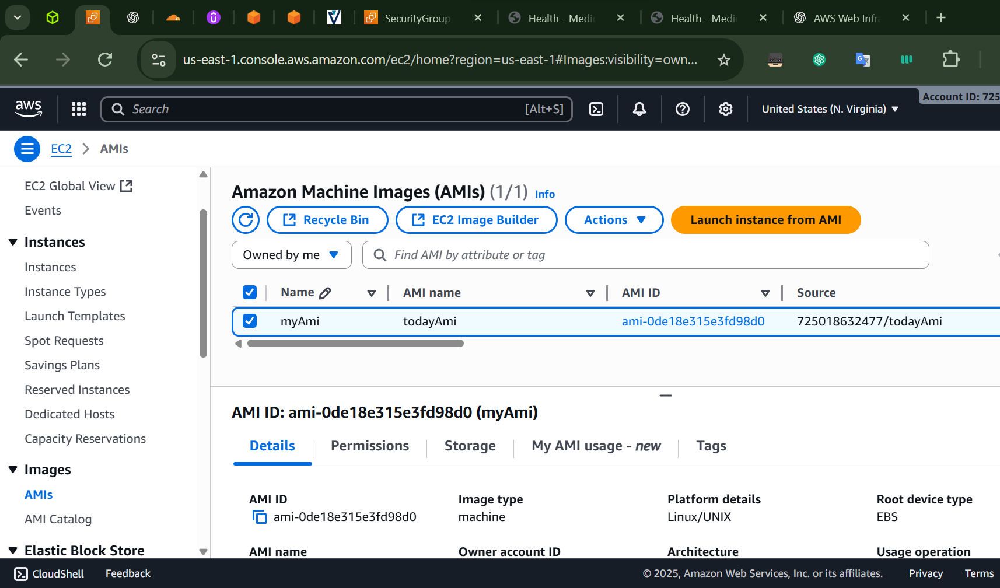
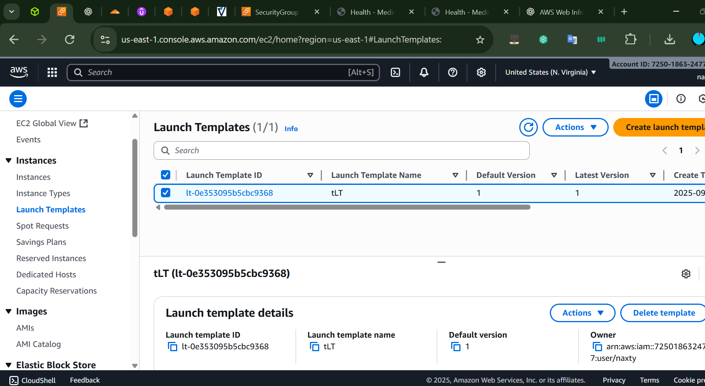
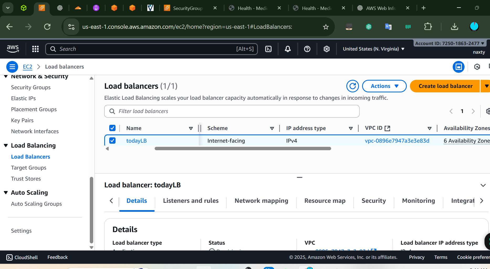
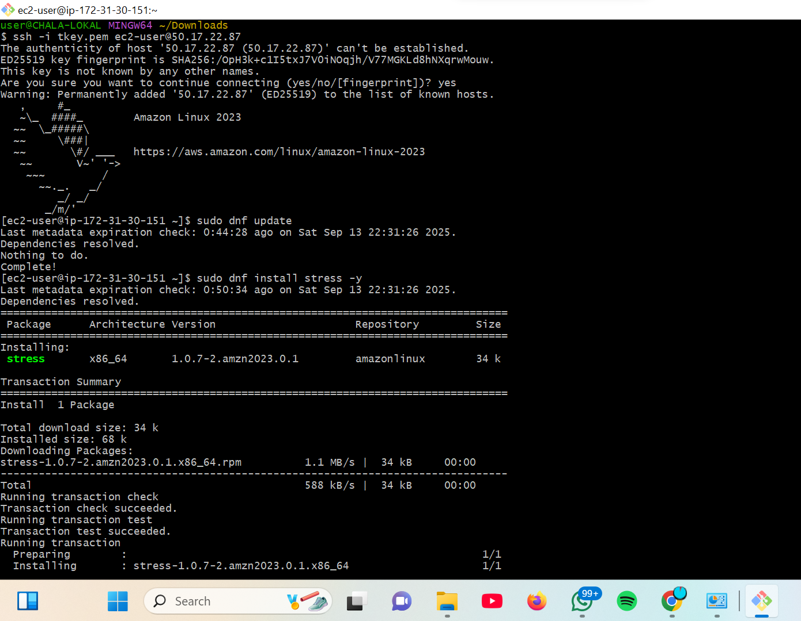
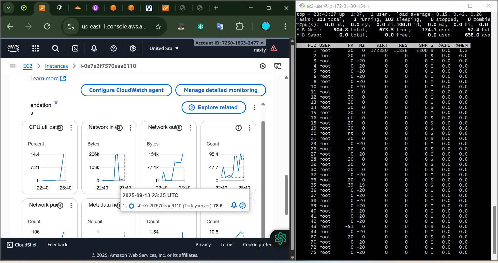

# AWS-Web-Infastructure-Setup
  
***Hands-on project for learning AWS infrastructure — covers EC2 deployment, AMI creation, Launch Templates, Load Balancer, CloudWatch monitoring, and stress testing.***

---

## Prerequisites

* AWS Account
* IAM user with **EC2**, **ELB**, **CloudWatch**, and **VPC** permissions
* SSH key pair (`.pem` file)
* AWS CLI configured or Git Bash

---

## Step 1: Launch EC2 Instance

### Objective

Create a base EC2 instance to host a webserver.

### Steps

1. Navigate to **EC2 → Launch Instance**.
2. Select **Amazon Linux 2** AMI.
3. Choose **t3.micro** (Free Tier).
4. Attach SSH key pair.
5. Configure **Security Group**:

   * Allow HTTP (80) → `0.0.0.0/0`
   * Allow HTTPS (443) → `0.0.0.0/0`
   * Allow SSH (22) → Your IP only

### Command

```bash
ssh -i my-key.pem ec2-user@<public-ip>
```



---

## Step 2: Create an AMI

### Objective

Capture a reusable image of the configured EC2 instance.

### Steps

1. Select the running instance in EC2.
2. Click **Actions → Image → Create Image**.
3. Provide AMI name and description.
4. Save the AMI ID.



---

## Step 3: Create Launch Template

### Objective

Standardize deployment of EC2 instances.

### Steps

1. Go to **EC2 → Launch Templates → Create Template**.
2. Specify:

   * Template name
   * Source AMI ID (from Step 2)
   * Instance type
   * Security group
   * Key pair
3. Save the template.



---

## Step 4: Configure Load Balancer (ALB)

### Objective

Distribute traffic across multiple instances.

### Steps

1. Go to **EC2 → Load Balancers → Create Load Balancer**.
2. Select **Application Load Balancer**.
3. Configure:

   * Listener: HTTP (80), HTTPS (443)
   * Availability Zones: Select subnets
4. Create a **Target Group** and register EC2 instances.
5. Access site via ALB DNS name.



---

## Step 5: CloudWatch Monitoring

### Objective

Monitor health and performance of the infrastructure.

### Steps

1. Metrics auto-collected: CPU Utilization, Network In/Out, ALB Requests.
2. Create Alarm:

   * Example: CPU Utilization > 70% for 5 minutes.
   * Action: Notify via SNS or trigger Auto Scaling.

📷 *\[Insert screenshot of CloudWatch metrics]*

---

## Step 6: SSH into the Instance

### Objective

Access the instance securely.

### Command

```bash
chmod 400 my-key.pem
ssh -i my-key.pem ec2-user@<public-ip>
```

## Step 7: Stress Testing the Server

### Objective

Simulate CPU and memory load to observe scaling/monitoring.

### Install stress tool
Amazon:

```bash
sudo dnf update && sudo dnf install -y stress
```

### Run stress test

```bash
stress --cpu 2 --vm 2 --vm-bytes 400M --timeout 60s
```

* `--cpu 2`: 2 CPU workers
* `--vm 2`: 2 memory workers
* `--vm-bytes 400M`: Each allocates 400MB
* `--timeout 60s`: Runs for 1 minute

### Monitor in real time

```bash
top
htop
```


---

## step 8:  Observe in CloudWatch

* CPU utilization spike
* Memory usage (via Enhanced Monitoring)



---

## Results / Observations

* EC2 instance successfully launched and tested.
* AMI created for reuse.
* Launch Template ensures consistent deployments.
* Load Balancer distributes traffic.
* CloudWatch provides visibility.
* Stress test validated monitoring setup.

---

## Next Steps

* Automate with Terraform or CloudFormation.
* Add Auto Scaling Group (ASG).
* Harden security with IAM roles and Systems Manager (no SSH needed).
